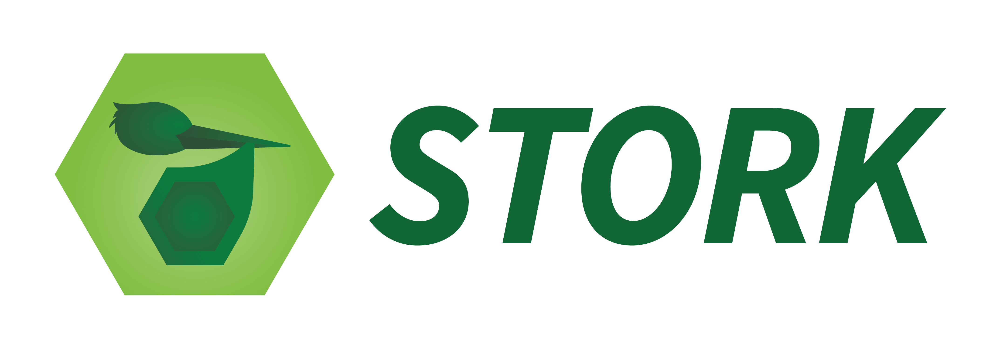

{: .hero-logo }

Stork seeks to serve as performance-portable middleware between additive
manufacturing simulation codes. Middleware is the software layer between
independent simulation tools: it supplies shared data structures,
transformations, and data movement so codes can exchange results efficiently
across CPUs and accelerators.

The current implementation supports thermal-to-microstructure coupling. It
represents coarse thermal history in the sparse Super Reduced Data Format
(SRDF), then interpolates it into fine-grid Reduced Data Format (RDF)
phase-change events for a microstructure model.

[Install Stork](docs/installation/){: .btn .btn-primary }
[Quick start](docs/quick-start/){: .btn }
[Read the paper](https://doi.org/10.1016/j.commatsci.2026.114832){: .btn }

## Why Stork?

Thermal and microstructure solvers operate at different spatial and temporal
scales. Passing a complete fine-grid temperature history between them can make
storage and data movement more expensive than either simulation. Stork bridges
the two grids with:

- a sparse **Super Reduced Data Format (SRDF)** for active coarse cells;
- Kokkos-parallel spatial and temporal interpolation;
- a compact **Reduced Data Format (RDF)** containing phase-change events; and
- host/device mirrors for file-based or in-memory workflows.

The accompanying paper reports more than two orders of magnitude reduction in
thermal-data generation time and file size for the studied workflows, and
preservation of grain morphology and texture for interpolation factors through
16. Those findings describe the paper's configurations; users should validate
the interpolation factor for their own process conditions.

## Requirements

Stork requires C++17, CMake 3.16 or newer, and Kokkos. The library is
header-only; the selected Kokkos backend determines whether interpolation runs
on a CPU or accelerator.

## At a glance

| Need | Start here |
|:--|:--|
| Build and install the library | [Installation](docs/installation/) |
| Convert an SRDF file | [Quick start](docs/quick-start/) |
| Understand SRDF and RDF | [Data model](reference/data-model/) |
| Integrate Stork in C++ | [Library API](reference/api/) |
| Connect Condor and Toucan | [Integration tutorial](tutorials/condor-toucan/) |
| Understand interpolation | [Interpolation](reference/interpolation/) |
| Check preconditions and limitations | [Contracts and limitations](reference/contracts/) |
| Read the methodology paper | [Paper](about/paper/) |

## Contributors

- [Benjamin Stump](https://www.ornl.gov/staff-profile/benjamin-c-stump)
- [John Coleman](https://www.ornl.gov/staff-profile/john-s-coleman)

## Scope

Stork performs sparse data representation, interpolation, data movement, and
serialization. It is not itself a thermal solver or a microstructure solver.
Today, a thermal code must construct SRDF data, and a downstream microstructure
application such as Toucan must consume the resulting RDF events. Additional
coupling directions and data models are future extensions of the middleware.
